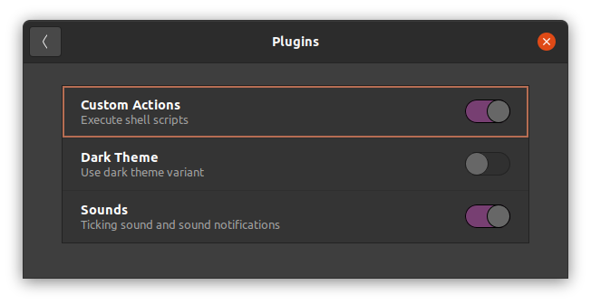
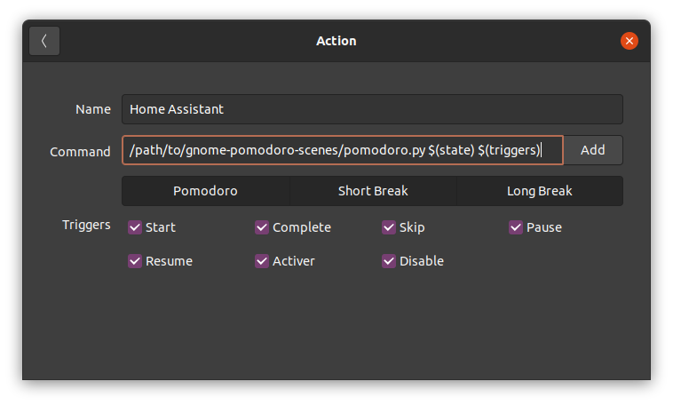

# gnome-pomodoro-scenes

This script is used to control [Home Assistant](https://www.home-assistant.io/) [scenes](https://www.home-assistant.io/integrations/scene) for [gnome-pomodoro](https://gnomepomodoro.org/).

When starting a pomodoro timer, you can enable a scene which you should configure in your Home Assistant. The scene could turn on a light bulb with a particular color.

## Scenes

These scene identifiers are expected, so make sure yours match:

 - `normal` when stopping the timer
 - `pomodoro_enabled` when the timer is running
 - `pomodoro_suspended` when the timer is paused (including during a break)
 - `pomodoro_short_break` during a short break
 - `pomodoro_long_break` during a long break

## Configuration
- Create a file named ~/.PomodoroHomeAssistant with a [long-lived access token](https://developers.home-assistant.io/docs/auth_api/#long-lived-access-token) and the URL to your Home Assistant server:

```
{
    "config": "your-long-lived-token",
    "url": "http://localhost:8123"
}
```

Test it with `./pomodoro.py pomodoro start`

In Gnome Pomodoro, enable the Actions plugin:



Go to *Preferences*, *Custom Actions...*, click the + button, and:
 - give it a name, like "Home Assistant"
 - Enter the path to `pomodoro.py` followed by `$(state) $(triggers)`
 - Enable all of Pomodoro, Short Break and Long Break
 - Toggle on all the triggers


